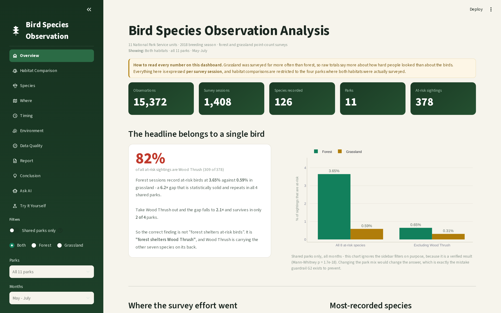
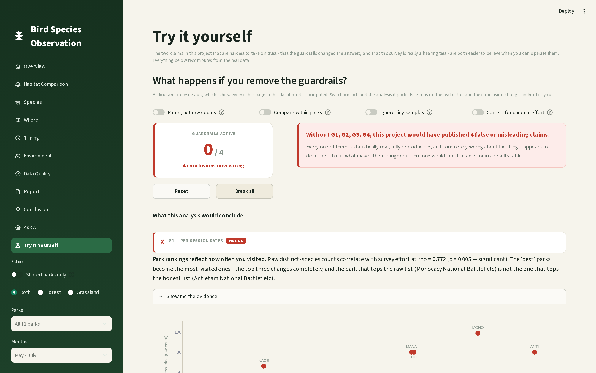
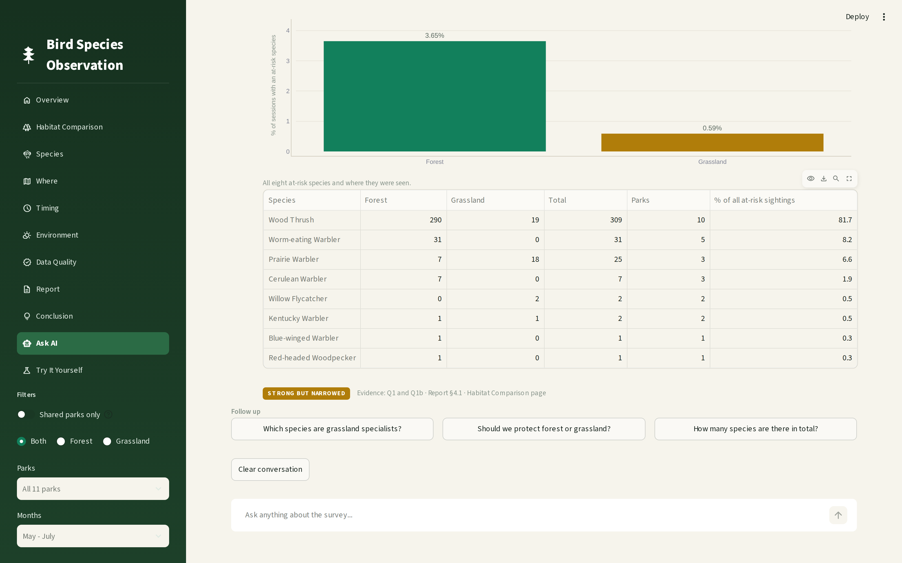
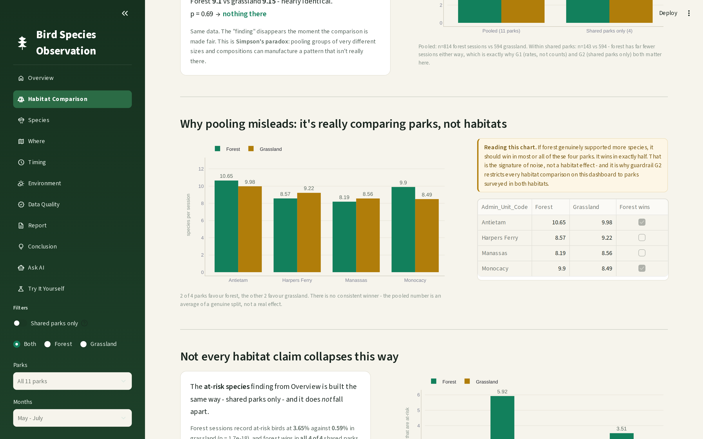
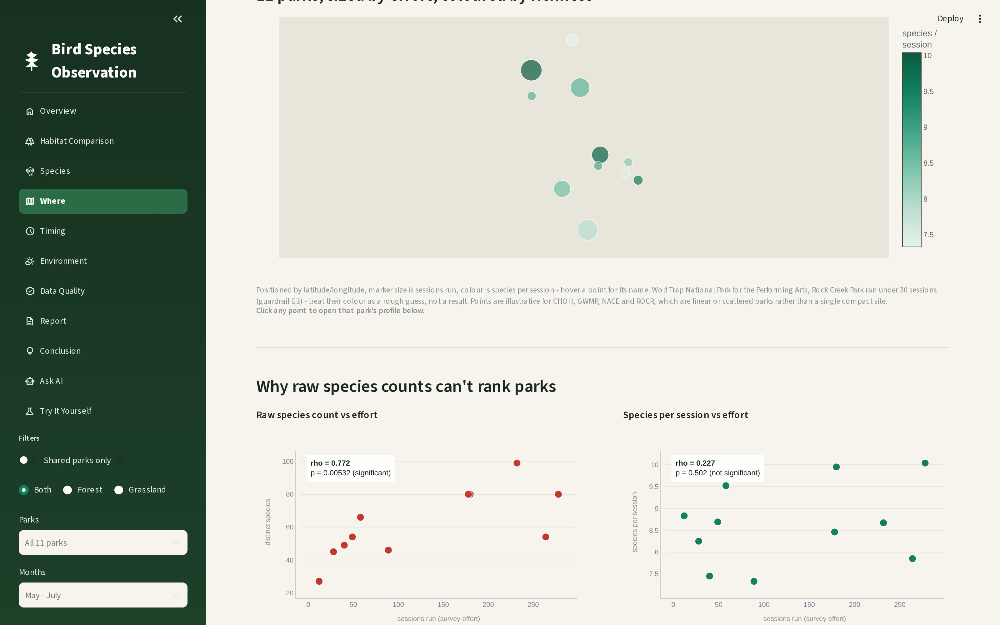
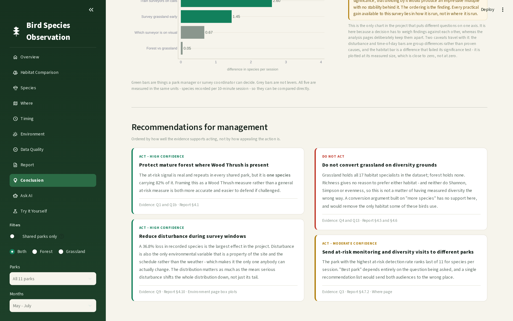

# Bird Species Observation Analysis

**A study of forest and grassland bird communities across 11 US National Park Service units — and an argument about how easy it is to publish a confident, reproducible, wrong answer.**

15,372 observations · 1,408 survey sessions · 126 species · 2018 breeding season



---

## The short version

This project set out to answer a simple question: **does habitat type affect bird species richness?**

Pooled across all 11 parks, the answer looks like a clear yes — grassland records significantly more species per session than forest (p = 4.5 × 10⁻⁴). That result is real, reproducible, and would survive peer review of the arithmetic.

It is also wrong.

Grassland was surveyed far more often than forest, and in *different parks*. Restrict the comparison to the four parks where both habitats were actually surveyed and the effect vanishes entirely (p = 0.69), with forest ahead in exactly 2 of 4 parks — a coin flip. The original finding was **Simpson's paradox**: park-level differences wearing a habitat costume.

That discovery reshaped the whole project. The dashboard reports what it *rejected* as carefully as what it found, and every figure is computed under four explicit guardrails that are documented, defended, and — on the **Try It Yourself** page — switchable, so you can watch the false conclusions reappear.

The single most uncomfortable finding is this:

> The habitat difference this survey was built to measure (**0.05** species per session) is smaller than the difference between the three people doing the measuring (**2.69**).

---

## Live demo

**[→ Open the dashboard](https://YOUR-APP-NAME.streamlit.app)**

*(Replace this link after deploying. See [Deployment](#deployment).)*

---

## Contents

- [What's in the dashboard](#whats-in-the-dashboard)
- [The four guardrails](#the-four-guardrails)
- [Key findings](#key-findings)
- [Quick start](#quick-start)
- [Reproducing the analysis from raw data](#reproducing-the-analysis-from-raw-data)
- [Project structure](#project-structure)
- [Design decisions worth explaining](#design-decisions-worth-explaining)
- [Data sources and licensing](#data-sources-and-licensing)
- [What this study cannot answer](#what-this-study-cannot-answer)

---

## What's in the dashboard

Eleven pages, 52 charts across the nine analysis pages, and two interactive sections.

| Page | What it covers |
|---|---|
| **Overview** | Headline figures, survey effort, most-recorded species, detection methods |
| **Habitat Comparison** | The central question, Simpson's paradox, diversity indices, community similarity |
| **Species** | Habitat specialists, rank-abundance curves, at-risk roster |
| **Where** | Interactive park map with click-to-drill-down profiles, plot rankings, disturbance by park |
| **Timing** | Time of day, seasonal patterns and why one of them cannot be claimed |
| **Environment** | Temperature, humidity, sky, wind, disturbance — with reliability masking |
| **Data Quality** | Observer effects, detection channels, protocol adherence, missingness |
| **Report** | The full written report, downloadable as PDF, Word or a markdown findings ledger |
| **Conclusion** | Confidence-rated conclusions, costed recommendations, what to change next season |
| **Ask AI** | Conversational Q&A over the analysis — 27 topics, no language model (see below) |
| **Try It Yourself** | The guardrail simulator and an ear-training test |

### The guardrail simulator

The most distinctive thing here. Four toggles, one per guardrail. Switch one off and the affected analysis **re-runs on the real data**, showing the conclusion this project would have published without it.



Break all four and you get four claims that are each statistically real, fully reproducible, and completely wrong about the thing they appear to describe.

### Ask AI — deliberately not a language model



The Ask AI page contains **no generative model**, and that is the point. Every other page argues that a number you cannot trace is a number you should not act on; bolting on a chatbot that could invent a plausible "8.7 species per session" would contradict the report one tab away.

Instead it is an intent-matching engine over the analysis pipeline: it recognises what a question is *about*, then assembles the answer from live values in `src/analysis.py`. It cannot hallucinate a figure, every answer carries a confidence badge and an evidence trail, and when it does not know something it says so. It also needs no API key, so it works identically for anyone opening the deployed link.

---

## The four guardrails

Every figure in this project is computed under all four. They are not decoration — without G2 this project would have confidently reported a habitat richness effect that does not exist.

| | Rule | Why | What breaks without it |
|---|---|---|---|
| **G1** | Per-session rates, never raw counts | A park visited twice as often records more species | Raw counts correlate with survey effort at **rho 0.77, p = 0.005** — the "best" parks become the most-visited ones |
| **G2** | Habitat comparisons within shared parks only | Comparing forest in one park with grassland in another compares the parks | A null result (p = 0.69) becomes a significant one (p = 0.00045). Simpson's paradox |
| **G3** | A 30-session reliability floor | Small samples produce large, meaningless extremes | The top plot scores 15.5 species per session — on **2 visits**. None of the top 5 survive the floor |
| **G4** | Rarefaction for unequal effort | Looking harder finds more species | Grassland appears to have **5.1×** more exclusive species. Rarefied, it is 1.3× |

---

## Key findings

Each carries a verdict, because a negative result honestly reported is worth more than a positive one that does not hold.

| Finding | Verdict |
|---|---|
| At-risk sightings are 6.2× more frequent in forest — but **82% of them are Wood Thrush**. Without that one species the gap falls to 2.1× and survives in only 2 of 4 parks | **Strong, narrowed** — act on it as a single-species result |
| **17 of 48** well-sampled species are grassland specialists. **Zero** are forest specialists | **Strong** |
| Serious disturbance costs **36.8%** of recorded species (3.28 per session) — the largest effect in the project | **Strong** |
| Grassland species counts are **17.6%** higher early morning than late; forest is flat | **Strong** |
| Three surveyors differ by **37%**, consistent in every park. The study survives only because the rota was balanced | **Methodological** |
| **88.2%** of detections are auditory, and the observer gap sits almost entirely on that channel (2.60 vs 0.67 visual) — an ear-training effect, not an effort effect | **Methodological** |
| Habitat does **not** affect species richness — and Shannon, Simpson and Pielou's evenness all agree (smallest p = 0.11) | **Negative result** |
| What *does* differ is weighting, not roster: Jaccard 0.536 vs 0.580, but Bray-Curtis separates by 0.148. Same species list, different mix | **Strong** |



---

## Quick start

Requires Python 3.9+.

```bash
git clone https://github.com/YOUR-USERNAME/bird-analysis.git
cd bird-analysis

python -m venv .venv
.venv\Scripts\activate          # Windows
# source .venv/bin/activate     # macOS / Linux

pip install -r requirements.txt
python -m streamlit run app/streamlit_app.py
```

The dashboard opens at `http://localhost:8501`. Processed data ships with the repository, so it runs immediately — no pipeline run needed.

---

## Reproducing the analysis from raw data

Everything downstream of the two source workbooks is reproducible:

```bash
python src/ingest.py            # read the raw .xlsx files
python src/clean.py             # cleaning, logged to docs/cleaning_log.md
python src/features.py          # build the session table
python src/analysis.py          # answer all 14 questions
```

Then regenerate the deliverables:

```bash
python src/check_report_refs.py # validate every cross-reference in the report
python src/make_report.py       # writes the PDF and Word report
python src/make_ledger.py       # writes docs/findings-ledger.md
```

`check_report_refs.py` exists because the report cites its own sections by number and those numbers are written by hand. When Q13 was inserted as §4.5 it silently invalidated fourteen later references. The validator builds the real heading list from the content model and resolves all 41 citations against it, so that mistake cannot survive twice.

### Optional: the ear test

The **Try It Yourself** page includes a listening quiz. It renders as a complete explanation with no audio installed and activates automatically when recordings appear:

```bash
python src/fetch_audio.py --manual   # species list + xeno-canto search links
python src/fetch_audio.py --scan     # build manifest.csv from downloaded files
python src/compress_audio.py         # trim to 20s, mono, MP3 (55 MB -> 2.6 MB)
```

---

## Project structure

```
bird-analysis/
├── app/                        # the Streamlit dashboard
│   ├── streamlit_app.py        # navigation, theme injection, sidebar filters
│   ├── data_access.py          # the only module that touches data (cached)
│   ├── theme.py                # one palette, one chart layout
│   ├── art.py                  # hand-built SVG sidebar illustration
│   └── views/                  # one file per page
├── src/                        # the analysis pipeline
│   ├── ingest.py               # read the raw workbooks
│   ├── clean.py                # cleaning, fully logged
│   ├── features.py             # the survey session table
│   ├── analysis.py             # all 14 questions, guardrails applied
│   ├── stats_helpers.py        # Mann-Whitney U and Spearman, numpy only
│   ├── report_content.py       # the report as typed blocks (one content model)
│   ├── make_report.py          # renders that model to PDF and Word
│   ├── make_ledger.py          # renders it to markdown
│   └── check_report_refs.py    # cross-reference validator
├── data/
│   ├── raw/                    # the two source workbooks
│   ├── processed/              # cleaned tables, committed so the app runs
│   └── reference/              # park coordinates
└── docs/                       # the report, ledger, cleaning log, screenshots
```

`data_access.py` is the only module in `app/` that opens a file or computes a statistic. Every headline figure comes from `analysis.py` — the same source the PDF and the ledger use — so a number can never drift out of sync between the dashboard and the report.

---

## Design decisions worth explaining

**One content model, three renderers.** The report exists once, as typed blocks in `report_content.py`. The dashboard page, the PDF (reportlab) and the Word document (python-docx) are three renderers over that model. They cannot disagree with each other, and a heading-consistency test verifies all 58 headings appear in all three.

**No scipy.** Its compiled DLLs are blocked by Windows Smart App Control on the development machine, so the two statistics this project needs — Mann-Whitney U and Spearman's rho — are implemented in `stats_helpers.py` with numpy alone and validated against `scipy.stats` on the real project data.

**No network calls at run time.** The park map was originally `px.scatter_geo`, which fetches topojson from a CDN on every draw. It rendered blank without internet. It is now plotted as plain x/y coordinates with a latitude-corrected aspect ratio, and the dashboard makes zero external requests — verified in testing.

**No language model.** See [Ask AI](#ask-ai--deliberately-not-a-language-model) above.

**Version floors, not pins.** `requirements.txt` uses `>=` at the release that introduced each feature actually used. Streamlit Cloud has been overriding `runtime.txt` and forcing newer Python versions; floors let pip resolve builds that exist for whatever it picks, where exact pins would fail the build.



---

## Data sources and licensing

**Survey data** — US National Park Service bird monitoring data for the Mid-Atlantic Network, 2018 breeding season. Two workbooks covering forest and grassland point-count surveys across 11 park units.

**Bird recordings** (optional, for the ear test) — sourced from [xeno-canto](https://xeno-canto.org) under Creative Commons licences. Each file's recordist, licence and source URL are recorded in `data/audio/manifest.csv` and displayed beneath every clip in the app, as those licences require. Clips are trimmed to 20-second excerpts; any recording under a NoDerivatives licence is left unmodified.

**This project's code** is available for review as part of a data analytics internship submission.

---

## What this study cannot answer

Listing this honestly is part of the work, not an apology for it.

- **Anything seasonal.** Visit number and calendar date correlate at rho 0.89, so a seasonal decline cannot be separated from a repeat-visit decline. No amount of post-hoc analysis fixes this; it needs a design change.
- **Anything about individual plots.** No plot was visited more than three times. The plot leaderboard is the right tail of a noisy distribution, not a list of good places.
- **Equivalence between habitats.** The null result rests on 143 forest sessions in 4 parks — enough to reject a strong claim, not enough to prove the habitats are the same.
- **The seven forest-only parks.** 671 sessions of real fieldwork cannot contribute to the central question at all.
- **Absolute species counts.** The observer spread means species-per-session carries a personal calibration band of roughly ±1.3 species. Comparisons *within* this dataset are sound; the absolute numbers should not be quoted against another study's.
- **Causation, anywhere.** Every environmental finding is a group difference from observational data.



---

## Deployment

Deployed on [Streamlit Community Cloud](https://share.streamlit.io):

1. Push the repository to GitHub
2. Create a new app pointing at `app/streamlit_app.py`
3. Set the Python version under **Advanced settings** — `runtime.txt` is currently unreliable on that platform
4. No secrets or API keys are required

---

## Author

**Tanay Nagpal** — data analytics internship project, 2026.

Built with Streamlit, pandas, numpy, Plotly, reportlab and python-docx.
